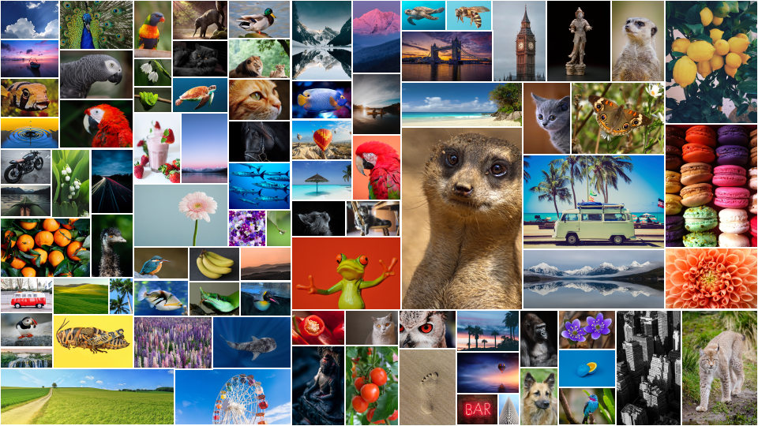

# Collage Solver - Creating collage using a genetic algorithm

## Getting started

You need to have [JDK 21](https://openjdk.org/) or higher installed, then run the installDist task:

```
./gradlew installDist
```

If the build step was successful you can then run the program using the created scripts ```build/dist/collage-solver```
or ```build/dist/collage-solver.bat``` if
you are running Windows. To try it out there are 87 sample images included in the ```docs/sample-images```  directory.
There are sensible default for all options and the only mandatory argument is the path to a directory
with the images you wish to create a collage. To create an example collage with one image featured you can try running:

```
./build/dist/collage-solver docs/sample-images surikat.jpg:8"
```

This command will create a  ```sample-images.png``` in the current directory looking something like the following image.
Your result will differ as this is an inherent property (pun intended!) of the genetic algorithm, however it should have the image of a
surikat stand out.



## Options

When creating collages you will most likely want to customize more of the available options - like a custom output size other
than the default 1920 x 1080. You can also drastically change the output by tweaking the different weight factors to adjust the output.

To see all options, simply run

```
./build/dist/collage-solver --help

Usage: collage [<options>] <path> [<featureimages>]...

Options:
  -o, --output=<text>                     image output name without extension, defaults to the directory name of path argument
  -w, --target-width=<int>                Width of output image (default: 1920)
  -h, --target-height=<int>               Height of output image (default: 1080)
  -bw, --border-width=<int>               Width of border framing each image (default: 2)
  -bc, --border-color=<value>             Border color in the form of a hexadecimal rgb string (like #ffffff for white) (default: java.awt.Color[r=255,g=255,b=255])
  -msf, --max-scale-factor=<float>        Max resize scale factor (1.0 means no larger that original size) (default: 1.0)
  -pop, --population-size=<int>           Population size (default: 1000)
  -gen, --generations=<int>               Number of generation to evolve (default: 500)
  -mp, --mutation-probability=<float>     Mutation probability (default: 0.25)
  -cc, --canvas-coverage=<float>          The weight factor for the canvas area coverage fitness score - or in other words, how important is it that the final image is completely covered by the images (without any gaps etc) (default: 1.0)
  -rac, --relative-area-coverage=<float>  The weight factor for relative image size preservation fitness score - or in other words, how important is it that the each image's relative size is preserved in the output image. (default: 10.0)
  -cf, --centered-feature=<float>         The weight factor for featured image centering fitness score - or in other words, how important is it that
                                          feature images are close to center in the output image. (default: 0.5)
  --help                                  Show this message and exit

Arguments:
  <path>           Path to a directory containing source images (png and jpeg supported)
  <featureimages>  "Feature image filename(s) and the desired relative size e.g ... sunny_day.jpg:5 ... The relative size weight determines how large an image should be in the output image compared to other images (whose relative image size factor by default is 1).
```

### General tips to creating a good-looking collage

I found that a good work process is to run the image generation several times and tweak the different options.

- Specify your desired target output size (```-w <width> -h <height>```) from the start before changing the other options as the output
  dimension is a key factor of the algorithm.
- If you find that there are large gaps in the finished output, most likely the output size is too large in relation to the combined images
  sizes. Use more images or decrease the output size.
- Use a higher population setting instead of the default 1000. It will take a bit longer to run but will almost always improve the results.
- If you in the console output can see that the scoring keeps improving through all generations you may wish run the program longer. Default
  is 500 generations.
- Tweak the weight factors and observe the changes by running the program iteratively.

## Background

As many others I have a lot of digital photos from holidays and events with friends and family.
I thought it would be fun to arrange them in a collage to create some large posters and then have them printed and in the end creating a "
wall size" collage of images.

I started doing this manually in a photo editing program, but soon gave up as it was taking forever...
Next I tried scripting a combination of [ImageMagick](https://imagemagick.org/) plugins to try to automate things, and it kind of worked,
but the result was not
very good-looking, with very repetitive patterns of layouts and either overlapping or irritating gaps between individual images.
I found some commercial alternatives, but none of them really seemed to be able to create collages with that many images.

I later stumbled upon a paper by Jian Fan [^1] that presented a way create collages by using a genetic algorithm (GA). I knew some of the
basic principles of GA, but have never
really used them for anything beyond very simple examples, so developing this application has been fun and educating.
The code in this repo is inspired by the general algorithm presented in Jian Fan's paper with some additions such as the ability to control
the centering of a featured image with a new fitness metric.

In this context - for a collage layout to be considered valid it must fulfill the following basic constraints:

- It should handle images with different dimensions and aspect ratios.
- An image may be scaled down (while maintaining its original aspect ratio).
- Images may not be cropped or rotated.
- Images may not overlap other images.
- All images must fit inside the defined canvas target size.

Creating a layout that fulfills these constraints is actually not that hard and the first part of the algorithm does precisely that.
Construct a population consisting of *n* scored individuals that fulfills the basic constraints listed using a naive slicing algorithm that
recursively divides the target canvas with random horizontal and vertical cuts.

It then randomly place each source image in the created leaf node slots - thereby creating a [full binary tree](https://en.wikipedia.org/wiki/Binary_tree)
structure.
Leaf nodes in the tree are hereafter referred to as "image nodes" and the internal nodes of the tree are called "layout nodes".
In GA lingo this layout tree is our representation of an *individual* in the *population* and the unique structure of its nodes can be thought of as its
*genes* or *chromosomes*.

But for a collage to be aesthetically pleasing we also want to:

1. Minimize any gaps or unused space in the target canvas.
2. Select "featured" images that are more prominently displayed by being relatively larger than other images.
3. Optionally have featured images near the center (only applicable in combination with 2)

Suddenly - the problem is not trivial at all! Or as described in the paper:
> "a NP-complete combinatorial optimization problem. An
> exhaustive search is impractical even for a modest number of photos"

This is where the use of [genetic algorithms](https://en.wikipedia.org/wiki/Genetic_algorithm) (GA) comes into play, as it allow us to
gradually improve a solution mimicking evolution by natural selection. In order to select parents to be allowed to spawn the next generation
me must have a quantifiable metric or *fitness score* as it's called in GA. In this case we actually have three metrics, one for each of the
three listed traits above.
These metrics combined constitutes an individuals fitness score (in our case a low score means better fitness)

## Algorithm

The steps of a GA are basically the same regardless of the type of problem you're trying to solve.

1. Select fittest individuals in the population.
2. Crossbreed selected individuals to create next generation.
3. Mutate (a proportion of) of the individuals in the population.
4. Score each individual and start over at step 1.

One iteration corresponds to one generation. Crossbreeding in this context means that an offspring
of two parents will be a mix of the layout nodes from each parents trees. The mutate operation will randomly swap either the layout
direction of a random layout node - or the image of two nodes. This will help the algorithm to escape a local optima.
The scoring consists of three weighted values - total canvas coverage, relative preservation of each image dimension and
finally how centered a featured image is. By tweaking the relative weight och each of these scoring weight factors you can control which
property is most important.

[^1]  ["J. Fan,Photo Layout with a Fast Evaluation Method and Genetic Algorithm"](https://ieeexplore.ieee.org/document/6266273),  
2012 IEEE International Conference on Multimedia and Expo Workshops, Melbourne, VIC, Australia, 2012, pp. 308-313,
doi: 10.1109/ICMEW.2012.59.


