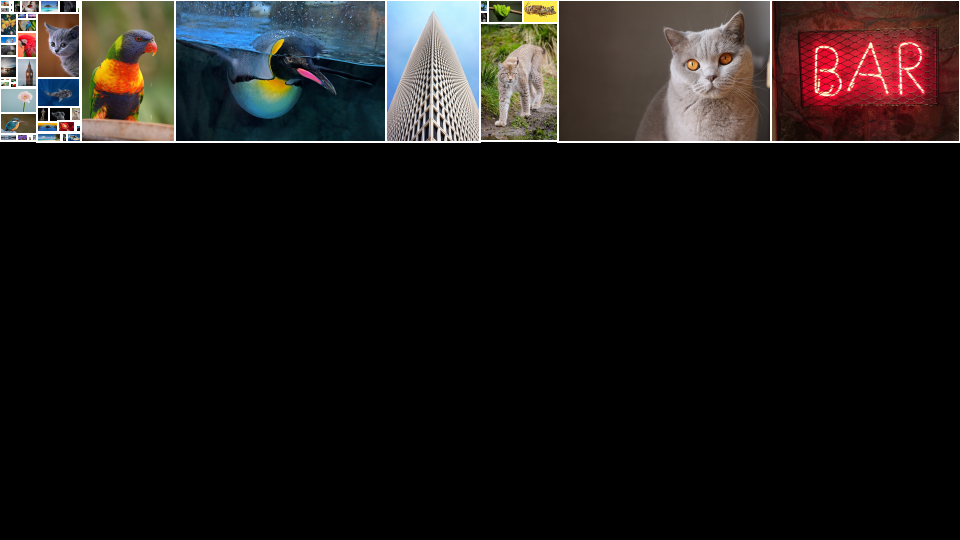

# Collage Solver - Creating collage using a genetic algorithm

## Getting started

You need to have [JDK 21](https://openjdk.org/) or higher installed, then run the installDist task:

```
./gradlew installDist
```

When the build step is complete, you can then run the program using the created scripts ```./build/install/collage-solver/bin/collage-solver```
or ```./build/install/collage-solver/bin/collage-solver.bat``` if you are running Windows.
To try it out, sample images are included in the ```docs/sample-images``` directory.
The program offers sensible default values for all options. The only required argument is the path to a directory 
containing the images you want to use for the collage. To create a sample collage with a featured image, try running:

```
./build/install/collage-solver/bin/collage-solver docs/sample-images surikat.jpg:8
```

This command will create a ```sample-images.png``` file in the current directory, looking something like the image below. 
Due to the nature of genetic algorithms, your results will vary, but an image of a surikat should be prominent.


## Options

You can customize many aspects of your collages, such as output size (default: 1920x1080). 
By adjusting weight factors, you can fine-tune the generated image's appearance. 
To see all available options, run:

```
./build/install/collage-solver/bin/collage-solver --help
```

```
Usage: collage [<options>] <path> [<featureimages>]...

Options:
  -o, --output=<text>                     Image output name without extension, defaults to the directory name of path argument
  -w, --target-width=<int>                Width of output image (default: 1920)
  -h, --target-height=<int>               Height of output image (default: 1080)
  -bw, --border-width=<int>               Width of border framing each image (default: 2)
  -bc, --border-color=<value>             Border color in the form of a hexadecimal rgb string (like ffffff for white) (default: java.awt.Color[r=255,g=255,b=255])
  -msf, --max-scale-factor=<float>        Max resize scale factor (1.0 means no larger that original size) (default: 1.0)
  -pop, --population-size=<int>           Population size, larger means better quality but longer generation time (default: 1000)
  -gen, --generations=<int>               Number of generation to evolve (default: 500)
  -mp, --mutation-probability=<float>     Mutation probability (default: 0.25)
  -cc, --canvas-coverage=<float>          The weight factor for the canvas coverage fitness score - or how important is it that the final image is completely covered by images (without any gaps etc) (default: 1.0)
  -rac, --relative-area-coverage=<float>  The weight factor for relative image size preservation fitness score - or how important is it that the each image's relative size is preserved in the output image. (default: 10.0)
  -cf, --centered-feature=<float>         The weight factor for featured image centering fitness score - or in other words, how important is it that
                                          feature images are close to center in the output image. (default: 0.5)
  --help                                  Show this message and exit

Arguments:
  <path>           Path to a directory containing source images (png and jpeg supported)
  <featureimages>  Featured image filename(s) and their desired relative size e.g:
                   ... sunny_day.jpg:5 ...
                   The relative size weight determines how large an image should be in the output image compared to other images (The default relative of an image is 1).
```

### General tips to creating a good-looking collage

I found that a good work process is to run the image generation several times and gradually tweak the different weight options.

- Always specify your desired target output size (```-w <width> -h <height>```) from the start before changing any other options as the
  output dimension is a key factor of the algorithm.
- If your collage has large empty gaps, the output size might be too large relative to the total size of your images. Add more images or reduce the output size.
- Increasing the population from the default 1000 can improve results, though it increases processing time.
- Monitor the console output for score improvement. If scores steadily increase through all generation, consider extending the default 500 generations running time.
- Experiment with weight factors to see their effects. Remember, weight factors are relative to each other and compete, so adjusting one impact the others. Avoid uniformly increasing all weights.

## Background

Like many people, I've accumulated a collection of digital photos from holidays and gatherings with friends and family. 
I thought it would be nice to transform these memories into stunning collages, print them as large posters or create 
an impressive, wall-sized collage artwork.

I started doing this manually in a photo editing program, but soon gave up as it was taking forever...
Next I tried scripting a combination of [ImageMagick](https://imagemagick.org/) plugins to try to automate things, and it kind of worked,
but the result was not very good-looking, with very repetitive patterns of layouts and either overlapping or irritating gaps between individual images.
I did look into some commercial alternatives, but none of them really seemed to be able to create collages with that many images.

During this search I discovered a paper by Jian Fan [^1] outlining a genetic algorithm (GA) approach to collage creation. While familiar with GA concepts, 
I hadn't applied them to an actual complex problem. The code in this repository is based on Fan's algorithm, with enhancements like a new fitness metric 
for centering featured images.

## Problem constraints
To be considered a successful collage layout, the resulting image collage must fulfill the following fundamental constraints:

- Image variability: Accommodate images with diverse dimensions and aspect ratios.
- Image scaling: Allow for image downscaling (not upscaling) while preserving original proportions.
- Image integrity: Maintain image integrity by prohibiting cropping and rotation.
- Spatial constraints: Prevent image overlap and ensure all images fit within the specified canvas target size.

Generating layouts that satisfy these constraints is relatively straightforward. The initial phase of the algorithm accomplishes 
this by using a slicing algorithm that recursively divides the target canvas with random horizontal and vertical cuts,
creating a [full binary tree](https://en.wikipedia.org/wiki/Binary_tree) structure.
Source images are then randomly assigned to the resulting leaf nodes. In GA terminology, this layout tree represents an *individual* within the *population*, 
with its unique node structure analogous to *genes* or *chromosomes*. Leaf nodes are referred to as *image nodes*, while internal nodes are *layout nodes*.



Image above shows example output after 1 generation using population size of 1 - effectively *not* using the genetic algorithm to illustrate what the naive slice and dice part alone achieves.
As you can se, no much of the target canvas is used, and relative sizes of the images are varying way too much and our featured surikat image is not even visible...
This is basically the starting point of a specific individual in the solution that the algorithm may evolve into something more aesthetically pleasing like the first image with the surikat.

To create a layout that meets the basic constraints is relatively straight forward but generating an aesthetically pleasing collage requires additional considerations:

- Space optimization: Minimize empty spaces within the canvas or gaps between images.
- Featured image prominence: Evenly distribute available space but also highlight specific images by allocating them larger sizes.
- Centered featured images: Optionally position featured images closer to the canvas center (when combined with image prominence).

Now the problem rapidly change from being a rather simple constraint satisfaction task to a complex optimization challenge. Just image the number of possible arrangements and resizing options 
that is possible with a collage of just 100 images!
As stated in the paper by Jian Fan [^1]:

> "a NP-complete combinatorial optimization problem. An
> exhaustive search is impractical even for a modest number of photos"

## Steps in a Genetic Algorithm
This is where [genetic algorithms](https://en.wikipedia.org/wiki/Genetic_algorithm) (GA) might help us. By simulating natural selection, GA allows us to iteratively improve solutions.

The core steps of a genetic algorithm are remarkably consistent across different problem domains.

- Selection: Choosing individuals with the highest fitness scores to become parents of the next generation.
- Crossover: Combining genetic material (in this case, layout information) from selected parents to create offspring.
- Mutation: Introducing random changes to the offspring's genetic makeup to maintain diversity.
- Evaluation: Assessing the fitness of the new population and repeating the process.
  
While the specific implementation of these steps vary widely depending on the domain - the underlying principles remain constant.

To guide our GA, we need a quantifiable measure or fitness score, so that we may find the fittest individuals in the population that will 
be parents of the next generation. In this collage algorithm we employ three metrics, each addressing a
specific aesthetic goals like fully filling the desired target size without gaps and representing featured images more prominently.

The metrics are combined to produce an overall fitness score of each individual in the population (lower scores indicate better fitness in this algorithm).
Each iteration of the algorithm produce a new generation. Offspring are created by combining layout nodes from two of the fittest parents. 
Mutation is a concept used to introduce random changes, either altering the orientation of a random layout node or swapping two images. 
Mutation helps the algorithm explore more diverse solutions and avoid suboptimal results which may occur by getting stuck in a local optima. 
The fitness of an individual is determined by a weighted sum of three factors that represents the goals mentioned earlier:

- Canvas coverage: How well the images fill the available space.
- Image size fulfillment: How closely image sizes match their desired proportions.
- Featured image centering: How centered the featured image is within the collage.

It is by adjusting the weights assigned to these factors that you can prioritize specific aesthetic goals and nudge the results in different directions.
Have fun with it!

[^1]: ["J. Fan,Photo Layout with a Fast Evaluation Method and Genetic Algorithm"](https://ieeexplore.ieee.org/document/6266273),  
2012 IEEE International Conference on Multimedia and Expo Workshops, Melbourne, VIC, Australia, 2012, pp. 308-313,
doi: 10.1109/ICMEW.2012.59.


